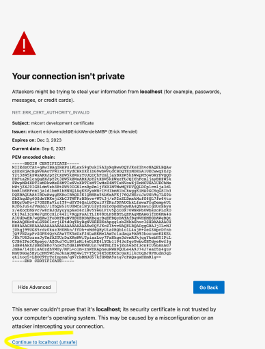

# Problemas com Certificado Inválido

Você verá uma mensagem igual à abaixo quando usando estes certificados:



Isso acontece pois o certificado que gerei, foi atrelado ao meu usuário. Mas não se preocupe, você pode clicar em avançado no browser e prosseguir para à aplicação.

## Você pode também gerar sua própria chave se necessário.

- Para gerar sua própria chave você precisa: 
    ## Mac
    - Instalar o [MKCert](https://github.com/FiloSottile/mkcert)

    - Colocar seu usuario como usuário válido para certificado, com o comando
     `mkcert -install`
    - Gerar a Key e o Cert:
    
    ```sh 
    mkcert -key-file key.pem -cert-file cert.pem 0.0.0.0 localhost 127.0.0.1 ::1
    ```

    ## Linux
    - Instalar o [OpenSSL](https://raspberrytips.com/installing-openssl-on-linux/)
    - Gerar a key e o Cert:

    ```sh
    openssl req -newkey rsa:2048 -nodes -keyout certificates/key.pem -x509 -days 365 -out certificates/cert.pem
    ```
     

